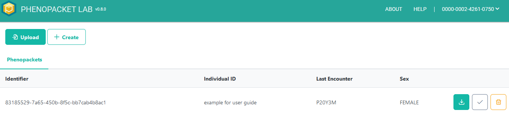
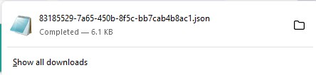
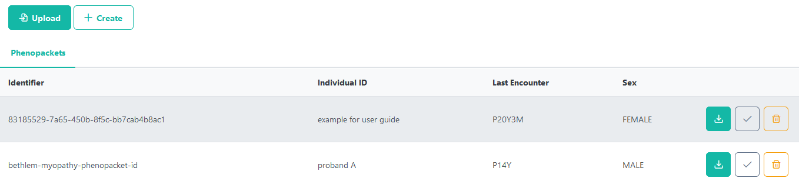
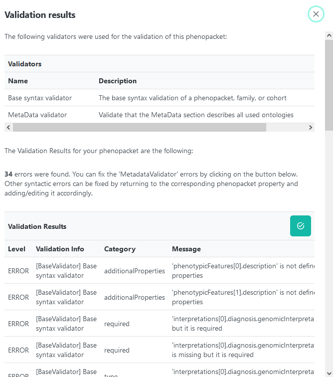
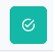

Phenopacket List Screen
=======================

A completed phenopacket is shown on the home screen. If the user
is logged in, this phenopacket will persist and be listed in the
future. From the list interface, a phenopacket can be validated
again, deleted, or downloaded in json format.

**Download Phenopacket in JSON Format**

Click on the download icon.

The download screen will depend on the user’s browser. Downloads
normally go into the Downloads folder. For example: Firefox
provides a window showing the file name, which by default uses
the phenopacket ID.

**Upload a Phenopacket from a JSON File**

If the user has a phenopacket in JSON format, click the Upload
button in the top left corner. Navigate to the folder location
where the phenopacket JSON file is located. Select the .json file
and click open. The system will import the phenopacket and
display it in the Phenopackets list.

It is recommended to validate an uploaded phenopacket by clicking
the Validate icon.

Imported phenopackets may not have all their ontologies listed in
the json or there may be some errors.

Clicking the fix metadata errors icon will fix the ontology
errors and often fix most, if not all, other errors. It may not
be necessary to fix some pre-existing errors.

